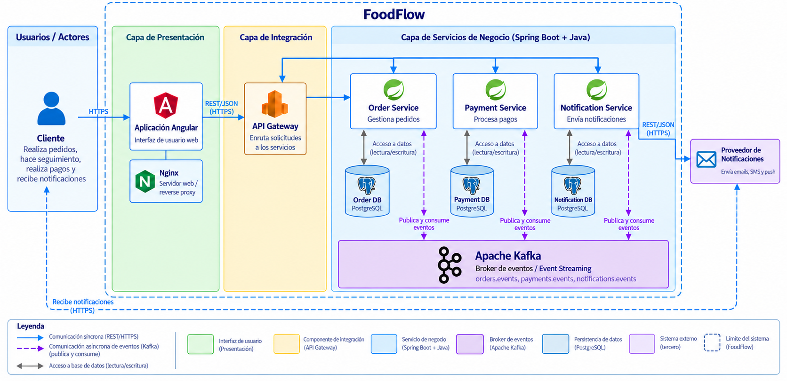
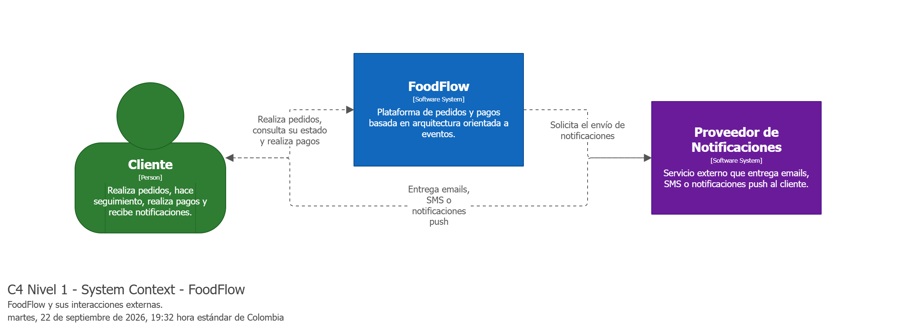
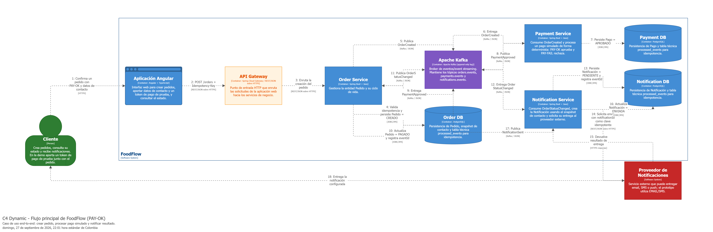

# Estilo y flujo end-to-end

[← Índice de la wiki](../Home.md)

## Diagrama de alto nivel

Las capas de FoodFlow: Cliente, Angular/Nginx, API Gateway, los tres servicios Spring Boot, una PostgreSQL por servicio, Apache Kafka y el proveedor de notificaciones. **El flujo principal entra únicamente por Order Service.**



## Contexto (C4 nivel 1)

El Cliente y el proveedor externo de notificaciones son los únicos actores del prototipo implementado.



> Imagen exportada del informe técnico (`docs/informe/main.tex`), que es la fuente de verdad del diseño.
> Sus fuentes (`workspace.dsl`, `.mmd`, `.puml`, `.dbml`) las versiona HU-704.

## Estilo

Event-Driven Architecture con topología **broker/coreografía**: no hay un componente que coordine todos los pasos; cada servicio reacciona de forma autónoma. Kafka aporta además características de *event streaming*: los eventos se conservan según la política de retención y pueden ser leídos por grupos independientes.

## Flujo canónico end-to-end

```text
Cliente -> Angular -> (REST/JSON) -> API Gateway -> POST /orders
   -> Order Service ---> Order DB
        | OrderCreated
        v
   Kafka [orders.events]
        v
   Payment Service ---> Payment DB        (PAY-OK / PAY-FAIL)
        | PaymentApproved | PaymentRejected
        v
   Kafka [payments.events]
        |                              |
        v                              v
   Order Service -> Order DB      Notification Service ---> Notification DB
        | OrderStatusChanged           | HTTPS/REST
        v                              v
   Kafka [orders.events]          Proveedor de Notificaciones
                                       |
                                       v
                               Notification Service
                                       | NotificationSent | NotificationFailed
                                       v
                               Kafka [notifications.events]
```

La misma secuencia, en la vista dinámica del informe:



> Imagen exportada del informe técnico (`docs/informe/main.tex`), que es la fuente de verdad del diseño.
> Sus fuentes (`workspace.dsl`, `.mmd`, `.puml`, `.dbml`) las versiona HU-704.

