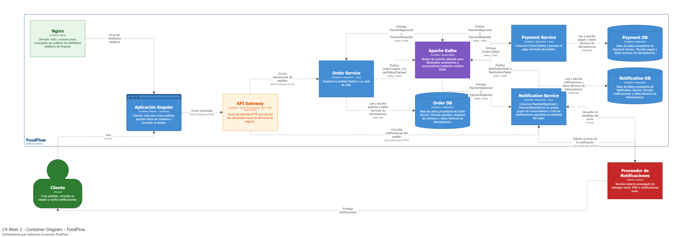

# Reglas arquitectónicas

[← Índice de la wiki](../Home.md)

## Contenedores (C4 nivel 2)

Cada base PostgreSQL se conecta exclusivamente con su servicio propietario, y Kafka se relaciona con los servicios, nunca con las bases. Las reglas 3 a 7 se leen directamente en este diagrama.

> Imagen exportada del informe técnico (`docs/informe/main.tex`), que es la fuente de verdad del diseño.
> Sus fuentes (`workspace.dsl`, `.mmd`, `.puml`, `.dbml`) las versiona HU-704.

## Reglas arquitectónicas obligatorias

1. Angular nunca accede directamente a Kafka ni a PostgreSQL.
2. Angular consume únicamente APIs HTTP expuestas por el API Gateway.
3. Order Service es el único propietario de Order DB.
4. Payment Service es el único propietario de Payment DB.
5. Notification Service es el único propietario de Notification DB.
6. Ninguna base PostgreSQL publica ni consume eventos Kafka, y Kafka nunca escribe directamente en PostgreSQL.
7. La comunicación asíncrona ocurre desde los servicios de aplicación hacia Kafka.
8. Order Service no llama por REST a Payment Service para iniciar el pago.
9. Payment Service inicia su procesamiento al consumir `OrderCreated`; el cliente **solo crea el pedido**.
10. Order Service y Notification Service reaccionan de forma independiente al resultado del pago.
11. Notification Service es el único servicio que llama al proveedor externo.
12. Los servicios no comparten tablas, repositorios JPA, modelos de persistencia ni clases de dominio.
13. Un fallo de Notification Service no impide que Order Service registre el resultado del pago.
14. Los consumidores son idempotentes.
15. Los errores transitorios usan reintentos controlados; los eventos no procesables terminan en DLQ.
16. Los eventos representan hechos ocurridos y no se modifican tras publicarse.
17. Todo evento usa los nombres y el envelope de la página [API REST](../03-contratos/api-rest.md).

## Qué reglas se verifican automáticamente (HU-006)

`bash scripts/verify-architecture.sh` comprueba las reglas que pueden automatizarse, sin CI. Con `--sin-tests` omite las pruebas ArchUnit y no compila.

| Comprobación | Cómo | Reglas |
|---|---|---|
| Ningún `pom.xml` depende de otro módulo `com.foodflow` | Script | 12 (sin código compartido) |
| En Compose, cada servicio recibe solo las variables de su propia base | Script. Hoy no hay servicios en Compose: se activa con HU-607 | 3, 4 y 5 |
| No hay literales de tópicos (`orders.events`, `payments.events`, `notifications.events` y sus DLQ) en el código de producción | Script | Tópicos solo en configuración |
| `@KafkaListener` y `KafkaTemplate` solo en `infrastructure.messaging` | ArchUnit (`ArchitectureTest` de cada servicio) | 7 y convenciones |
| El paquete `domain` no depende de `api` ni de `infrastructure` | ArchUnit | Capas |
| Order y Payment no usan clientes HTTP salientes; en Notification solo `infrastructure.provider` | ArchUnit | 8 y 11 |

Las reglas de comportamiento (idempotencia, reintentos y DLQ, independencia ante fallos) no se prueban aquí: las cubren las pruebas de cada HU y HU-605/HU-606.

## Decisión sobre el pago (ADR-10)

El cliente crea el pedido; `OrderCreated` dispara el pago. El resultado es determinista: `PAY-OK` produce `PaymentApproved` y `PAY-FAIL` produce `PaymentRejected`. Payment Service no consulta a Order Service, y no existe llamada `Order -> Payment` ni orquestador.
