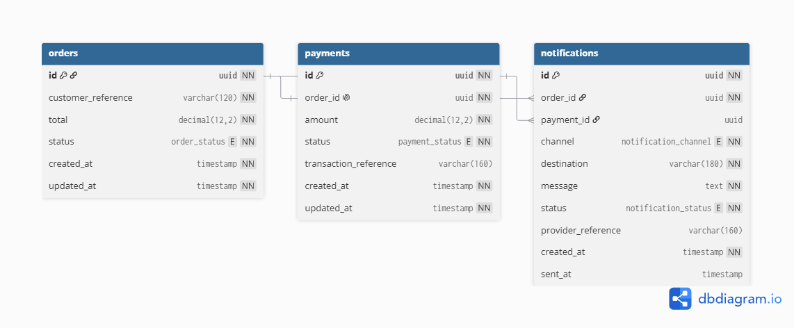

# Persistencia

[← Índice de la wiki](../Home.md)

## Modelo de datos

Una base por servicio, sin claves foráneas entre servicios: la relación entre Pedido, Pago y Notificación se mantiene por `orderId` propagado en los eventos.

> Imagen exportada del informe técnico (`docs/informe/main.tex`), que es la fuente de verdad del diseño. Su fuente (`.dbml`) la versiona HU-704.

## Tablas y campos mínimos

Nombres de columna en `snake_case`; los campos siguientes se muestran en `camelCase` por legibilidad.

| Servicio | Tablas y campos mínimos |
|---|---|
| Order | `orders`: `id`, `customerReference`, `notificationChannel`, `customerContact`, `paymentToken`, `total`, `status`, `createdAt`, `updatedAt`. `idempotency_keys`: `key` (PK), `requestHash`, `orderId`, `createdAt`. `processed_events`. |
| Payment | `payments`: `id`, `orderId` (**único**), `amount`, `status` (`APROBADO` o `RECHAZADO`), `reasonCode`, `transactionReference`, `createdAt`, `updatedAt`. `processed_events`. |
| Notification | `notifications`: `id`, `orderId`, `paymentId`, `channel`, `destination`, `content`, `status`, `failureCode`, `attempts`, `createdAt`, `updatedAt`. `processed_events`. |

`processed_events` (ADR-09): `eventId` (PK, restricción única), `consumer`, `processedAt`. Su registro y el efecto de negocio se escriben en la **misma transacción local**; el offset se confirma solo después del commit.

Estados: `orders.status` es `CREADO`, `PAGADO` o `PAGO_RECHAZADO`; `payments.status` es `APROBADO` o `RECHAZADO`; `notifications.status` es `PENDIENTE`, `ENVIADA` o `FALLIDA`. El catálogo lo fija el informe técnico (entidades de negocio); Los tres lo comprueban con una restricción `CHECK`: `payments_status_valido` la añade HU-202, igual que `orders` y `notifications` ya la tenían desde HU-002.

## Catálogos de Payment (HU-202)

| Campo | Valores | Nota |
|---|---|---|
| `payments.status` | `APROBADO`, `RECHAZADO` | El pago es determinista (ADR-10): el resultado se conoce al procesar `OrderCreated`, así que no hay estado pendiente. Un pago existe solo cuando ya está resuelto |
| `payments.reasonCode` | `PAGO_RECHAZADO_POR_TOKEN` | Único motivo del prototipo: el pedido llegó con `PAY-FAIL`. Nulo cuando el pago fue aprobado. Es el valor que viaja en `PaymentRejected.payload.reasonCode` |
| `payments.transactionReference` | `TXN-<yyyyMMdd>-<orderId>` | Referencia propia del servicio, no de una pasarela externa: el prototipo no integra ninguna. Nunca nula, también cuando el pago se rechaza. Lleva el `orderId` completo, no un prefijo: así su unicidad se hereda de la de `order_id` |

`payments.orderId` es **único**: un pedido tiene a lo sumo un pago. Es lo que impide cobrar dos veces el mismo pedido si `OrderCreated` se reprocesa, con independencia de `processed_events`.

**Creación del esquema:** scripts SQL versionados en `infrastructure/postgres/<db>/` y `spring.jpa.hibernate.ddl-auto=validate`. Flyway es opcional (página [Visión y alcance](../01-producto/vision-y-alcance.md)).
