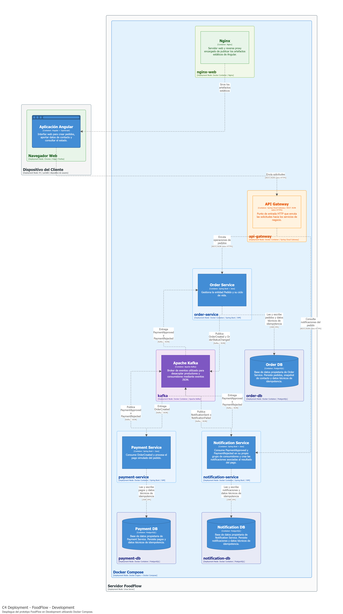

# Runbook de la demostración

[← Índice de la wiki](../Home.md)

> Guion reproducible de la demo de la sustentación (HU-706). Cada comando de esta página se ejecutó contra el entorno completo el **2026-10-01**, partiendo de un entorno recién levantado, y la salida que aparece es la que se obtuvo.

## Cuándo usarlo

En el **bloque 3** de la [agenda de la sustentación](../06-backlog/sustentacion.md): 4 minutos, que bajan a 2 si la ventana se reduce a 10. También sirve para ensayar.

## Qué se levanta



> Imagen exportada del informe técnico (`docs/informe/main.tex`), que es la fuente de verdad del diseño. Su fuente es `fuentes/foodflow-structurizr-v9.dsl` (HU-704). Para la presentación existe además la versión horizontal, `c4-deployment-development-horizontal.png`.

Once contenedores: Angular (Nginx), API Gateway, Order, Payment y Notification Service, tres PostgreSQL, Kafka, el proveedor simulado y `kafka-init`, que crea los tópicos y termina.

## Prerrequisitos

- Docker (o Podman) con Compose, el repositorio clonado y `.env` creado desde `.env.example`.
- **Memoria libre suficiente.** Con menos de unos 2 GB libres el sistema empieza a paginar y la convergencia se dispara, hasta superar 5 s ([Atributos de calidad medidos](pruebas/atributos-de-calidad.md)). Cierra el resto de aplicaciones antes de la sustentación.
- En **Git Bash para Windows**, antepón `MSYS_NO_PATHCONV=1` a los `docker exec` de abajo: si no, Git Bash reescribe `/opt/...` como una ruta de Windows.

## Antes de la sustentación (10 minutos antes)

1. **Partir de un entorno limpio.** Kafka no tiene volumen, así que `down.sh` lo vacía. Un *broker* con historial de ejecuciones anteriores es lo que hizo fallar la primera validación de punta a punta.

   ```bash
   bash scripts/down.sh
   bash scripts/up.sh --sin-build      # ~40 s con las imágenes ya construidas
   ```

2. **Calentar y comprobar.** La primera petición a una JVM recién arrancada es lenta, y así no ocurre delante del jurado:

   ```bash
   bash scripts/smoke-test.sh          # RESULTADO: OK
   ```

3. **Abrir de antemano** el navegador en `http://localhost:4200` y una terminal en la raíz del repositorio con estas variables:

   ```bash
   G=http://localhost:8080
   pedido(){ curl -sS -D - -o /dev/null -H 'Content-Type: application/json' \
     -H "Idempotency-Key: demo-$RANDOM" -X POST $G/orders \
     -d "{\"customerReference\":\"DEMO\",\"customerContact\":\"$2\",\"notificationChannel\":\"EMAIL\",\"total\":45000.00,\"paymentToken\":\"$1\"}" \
     | sed -n 's#^[Ll]ocation: .*/orders/##p' | tr -d '\r'; }
   ```

## Guion (bloque 3)

| # | Paso | Qué se dice | Tiempo |
|---|---|---|---|
| 1 | Pedido `PAY-OK` **desde la interfaz** | El cliente solo crea el pedido; el pago ocurre después, por eventos | 0:45 |
| 2 | Pedido `PAY-FAIL` | El pago es determinista (ADR-10); el pedido termina en `PAGO_RECHAZADO` | 0:30 |
| 3 | Trazar el pedido por los tres tópicos | Un solo `correlationId` atraviesa tres servicios que no se llaman entre sí | 1:00 |
| 4 | Fallo del proveedor (`@fail.test`) | Un fallo de negocio deja la notificación en `FALLIDA`, **no** va a la DLQ y no afecta al pedido (reglas 10 y 12) | 0:45 |
| 5 | Evento defectuoso a la DLQ | El evento no procesable sale de la partición en vez de bloquearla; llega **una vez por consumidor** (abanico) | 1:00 |
| | **Total** | | **4:00** |

**Versión de 2 minutos** (ventana de 10): paso 1 en vivo y, en lugar de los pasos 2 a 5, la tabla de la sección «Salida esperada» como traza ya capturada. El bloque 2 de Sara ya habrá explicado el abanico.

### 1. Pedido aprobado (interfaz)

En `http://localhost:4200`: crear un pedido con token **PAY-OK** y contacto `cliente@foodflow.test`. La vista de seguimiento pasa de `CREADO` a `PAGADO` y muestra la notificación `ENVIADA` con el texto «Tu pago de 45.000,00 COP fue aprobado.». El mensaje habla del pago y no del pedido, porque la notificación puede salir antes de que el pedido cambie de estado (abanico, ADR-08).

### 2. Pedido rechazado

```bash
FAIL=$(pedido PAY-FAIL cliente@foodflow.test); sleep 2
curl -sS $G/orders/$FAIL                    # "status":"PAGO_RECHAZADO"
curl -sS $G/orders/$FAIL/notifications      # "status":"ENVIADA"
```

### 3. Trazar un pedido por los tres tópicos

```bash
OK=$(pedido PAY-OK cliente@foodflow.test); sleep 2
for t in orders.events payments.events notifications.events; do
  echo "== $t"
  MSYS_NO_PATHCONV=1 docker exec foodflow-kafka /opt/kafka/bin/kafka-console-consumer.sh \
    --bootstrap-server kafka:9092 --topic $t --from-beginning \
    --formatter-property print.key=true --timeout-ms 5000 2>/dev/null | grep "^$OK"
done
```

La clave de cada mensaje es el `orderId` (clave de partición, ADR-04). Se señala `eventType` y `correlationId` en cada línea.

### 4. Fallo del proveedor

```bash
FALLO=$(pedido PAY-OK cliente@fail.test); sleep 3
curl -sS $G/orders/$FALLO                   # "status":"PAGADO"   (el pedido no se entera)
curl -sS $G/orders/$FALLO/notifications     # "status":"FALLIDA"  (tras 3 intentos)
```

La respuesta muestra `"attempts":3` (el adaptador reintentó antes de rendirse) y el destino enmascarado, `c***@fail.test`, igual que en los logs.

### 5. Un evento defectuoso termina en la DLQ

```bash
echo 'demo-dlq:{"eventId":"no-es-un-uuid","eventType":"PaymentApproved","eventVersion":99}' \
 | MSYS_NO_PATHCONV=1 docker exec -i foodflow-kafka /opt/kafka/bin/kafka-console-producer.sh \
     --bootstrap-server kafka:9092 --topic payments.events \
     --reader-property parse.key=true --reader-property key.separator=:
sleep 4
MSYS_NO_PATHCONV=1 docker exec foodflow-kafka /opt/kafka/bin/kafka-console-consumer.sh \
  --bootstrap-server kafka:9092 --topic payments.events.dlq --from-beginning \
  --formatter-property print.headers=true --timeout-ms 6000 2>/dev/null \
 | grep -a -o 'kafka_dlt-original-consumer-group:[^,]*\|kafka_dlt-exception-cause-fqcn:[^,]*\|threw exception; [^,]*'
```

Muestra el mismo evento **dos veces**, una por grupo (`order-service.payments` y `notification-service.payments`), con causa `UnsupportedEventException` y el motivo legible. Ninguno de los dos consumidores quedó bloqueado: después se puede crear otro pedido y converge igual.

## Salida esperada

Ejecución del 2026-10-01 sobre un entorno recién levantado (`up.sh --sin-build` en 41 s):

| Escenario | Pedido | Notificación |
|---|---|---|
| `PAY-OK`, `cliente@foodflow.test` | `PAGADO` | `ENVIADA` |
| `PAY-FAIL`, `cliente@foodflow.test` | `PAGO_RECHAZADO` | `ENVIADA` |
| `PAY-OK`, `cliente@fail.test` | `PAGADO` | `FALLIDA` |

Eventos del pedido `PAY-OK`, todos con el mismo `correlationId`:

```
== orders.events          OrderCreated, OrderStatusChanged
== payments.events        PaymentApproved
== notifications.events   NotificationSent
```

DLQ tras el paso 5:

```
causa: UnsupportedEventException
motivo: el cuerpo no es un envelope v1 legible: Cannot deserialize value of type `java.util.UUID` from String "no-es-un-uuid" ...
grupo: order-service.payments
causa: UnsupportedEventException
motivo: (el mismo)
grupo: notification-service.payments
```

## Si algo falla en vivo

| Síntoma | Causa probable | Qué hacer |
|---|---|---|
| El pedido se queda en `CREADO` más de 5 s | Memoria escasa o eventos antiguos en el *broker* | Pasar a la traza capturada de «Salida esperada»; tras la sesión, `down.sh` y `up.sh` |
| `up.sh` no termina con todo `healthy` | Un contenedor no arrancó a tiempo | `docker compose ... ps` para ver cuál; `bash scripts/up.sh --sin-build` otra vez |
| El consumidor de consola no imprime nada | Git Bash reescribió la ruta | Anteponer `MSYS_NO_PATHCONV=1` |
| Tras reiniciar Docker los servicios no resuelven `order-db` (o las otras bases) | Los contenedores quedaron en la red anterior | `bash scripts/down.sh` y `bash scripts/up.sh --sin-build`. Un `docker start` no basta, porque no recrea la red |

## Restablecer el entorno

`bash scripts/down.sh` y `bash scripts/up.sh --sin-build`. `down.sh` vacía Kafka y conserva las bases; `bash scripts/down.sh --limpiar` borra también las bases.
